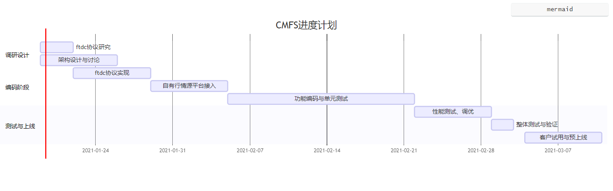

# 仿CTP行情前置系统项目

## 一、项目实现目标

本仿CTP行情前置系统（下简称为**CMFS**）用于替换速度较慢的ctp行情前置， 在兼容ftdc协议的基础上， 将内部极速行情进行转发， 并提供鉴权功能

1. 功能
   + 仿CTP行情API协议, 实现接口完全兼容
   + 根据后端存储的客户号进行鉴权
   + 实现订阅接口的合约模糊匹配订阅
2. 性能
   + 单前置1000用户全量订阅
   + 转发速度优于CTP前置

## 二、功能列表

| 功能 | 对应api方法 | 描述 |
| - | - | - |
| 获取交易日 | GetTradingDay | 通过api实例查询交易日信息 |
| 初始化连接 | Init | 通过tcp的ftdc协议连接到CMFS |
| 客户登录 | ReqUserLogin | 客户登录， 提供客户号校验 |
| 客户登出 | ReqUserLogout | 客户登出 |
| 行情订阅 | SubscribeMarketData | 提供行情订阅接口， 可根据合约号模糊订阅 |
| 行情退订 | UnSubscribeMarketData | 提供行情退订接口， 可根据合约号模糊取消订阅 |
| 实时行情推送 | OnRtnDepthMarketData | 行情实时推送接口 |

## 三、数据流图

todo 

## 四、工作计划

0. 调研阶段  （ftdc协议研究， 架构设计与讨论）
1. ftdc协议实现
2. 自有行情源平台接入
3. 功能编码完整实现与单元测试
4. 性能测试与调优
5. 整体测试与验证
6. 客户试用与预上线

