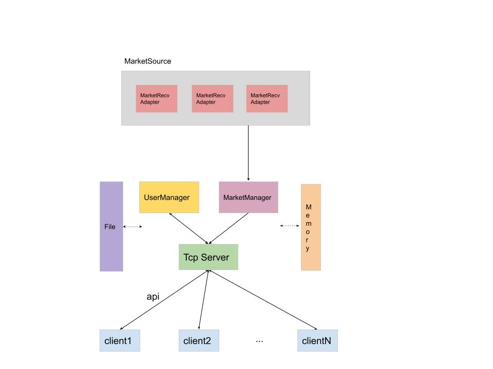
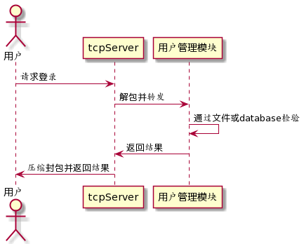
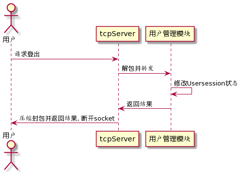
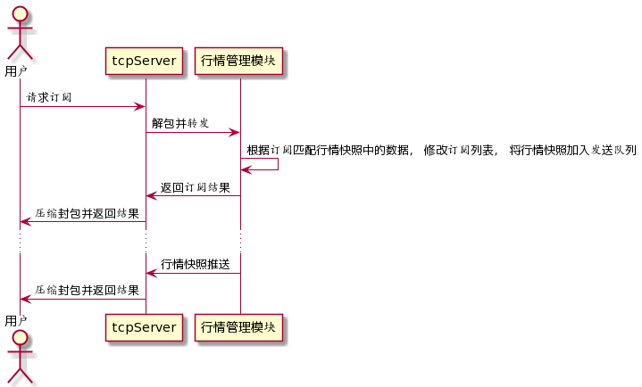
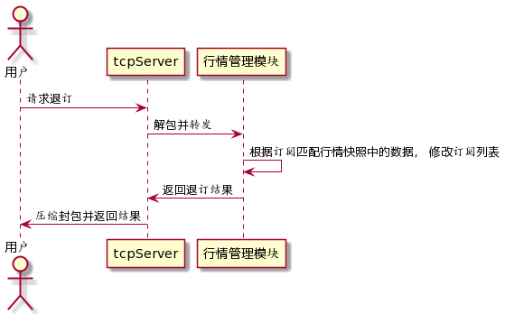
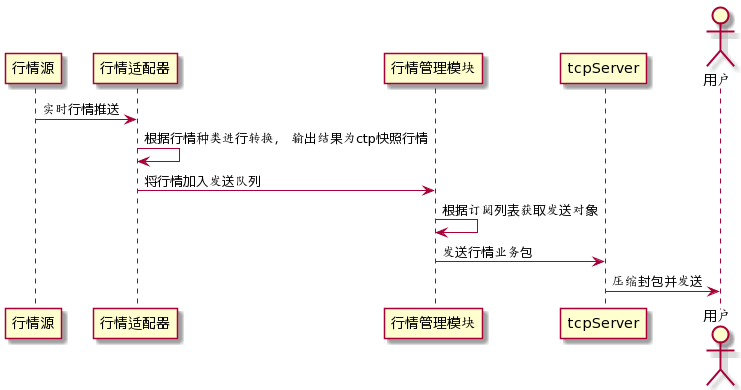

# CFMS架构设计

## 1. 实现目标

1. 针对 CTP api 进行 FTDC协议编解码
2. 单机支持 1000 用户全量行情订阅（订阅接口支持模糊匹配）
3. 上游数据源可扩展

## 2. 网络通信

采用asio + socket, 实现异步tcp server。其中asio使用一个异步io_context 管理tcp客户连接和客户端请求， 一个同步io_context处理行情转发。

## 3. 组件逻辑图

## 4. 线程模型

## 5. 功能模块
详细见 [各模块功能列表](./功能列表.md)
1. 网络通信模块
2. 自定义编解码模块
3. 行情接收模块
4. 行情分发模块
5. 用户会话管理模块
6. 基础组件模块（日志、配置）

## 6. 主要功能时序图

- 用户登录时序图  
    
- 用户登出时序图  
    
- 用户订阅时序图  
    
- 用户退订时序图  
    
- 用户推送时序图  
    