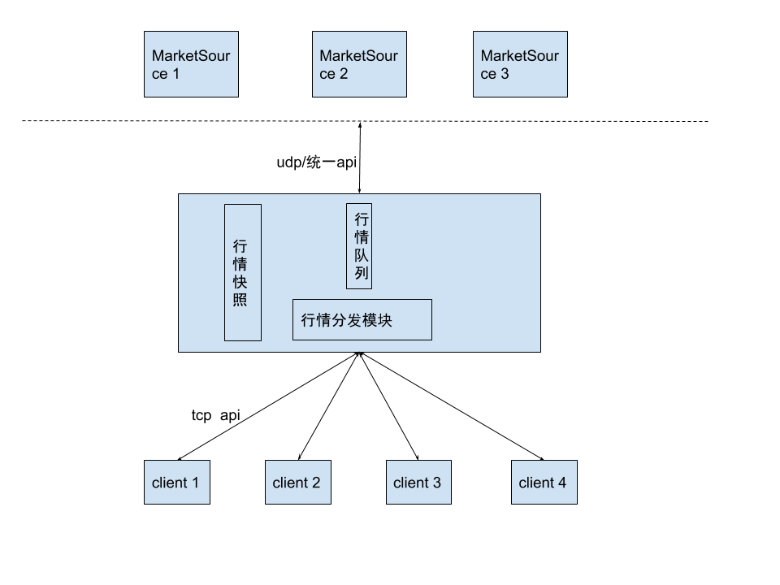

# CFMS架构设计

## 1. 实现目标

1. 针对 CTP api 进行 FTDC协议编解码
2. 单机支持 1000 用户全量行情订阅（订阅接口支持模糊匹配）
3. 上游数据源可扩展

## 2. 网络通信

采用asio + socket, 实现异步tcp server。其中asio使用一个io_context 管理tcp客户连接和客户端请求， 一个io_context处理行情转发。

## 3. 数据流图

## 4. 线程模型

## 5. 功能模块

1. 网络通信模块
2. 自定义编解码模块
3. 行情接收模块
4. 行情分发模块
5. 用户会话管理模块
6. 基础组件模块（日志、配置）